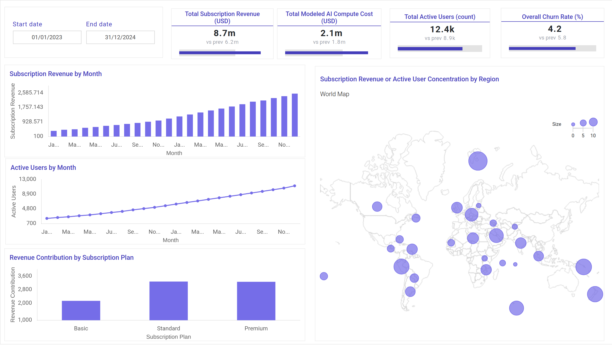
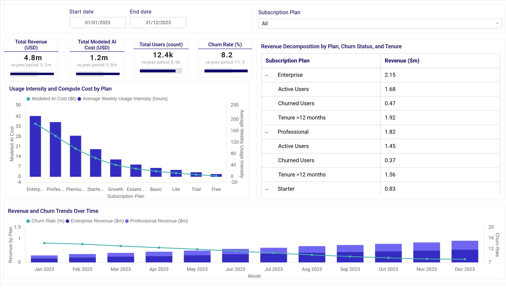
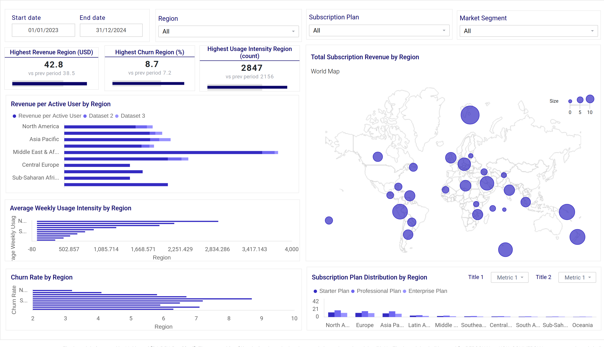
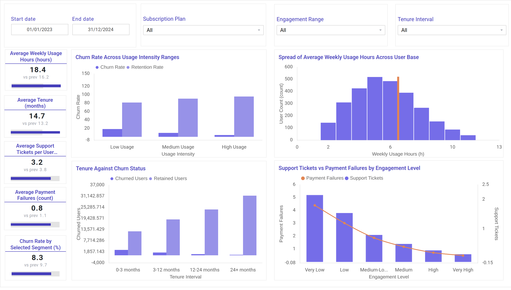

# AI Cost vs. User Value Optimization in SaaS Platforms

**Khushi Shah**

---

## Project Overview

As SaaS platforms increasingly integrate generative AI capabilities, balancing inference cost with delivered user value has become a critical business challenge. AI features introduce variable compute expenses, making it essential to understand how usage behavior translates into revenue, retention, and profitability.

This project develops interactive visual analytics dashboards to evaluate AI usage, modeled compute cost, churn behavior, and revenue contribution. The goal is to support data-driven decisions related to pricing strategy, feature investment, and AI cost optimization within a SaaS environment.

The dashboard integrates temporal, geospatial, categorical, and structural perspectives to provide both executive-level summaries and detailed drill-down analysis.

---

## Prior Work and Context

Research in AI economics highlights the importance of monitoring cost-to-value dynamics when deploying generative AI at scale (Gartner, 2023). Visualization theory further emphasizes aligning analytic views with stakeholder decision needs (Munzner, 2014).

Building on these principles, this project models AI cost relative to user engagement and subscription revenue, translating analytical insights into stakeholder-focused dashboard views.

---

## Stakeholder Groups

Different organizational roles require distinct analytical perspectives:

- **Product Managers** – Evaluate engagement sustainability and retention patterns  
- **Finance Teams** – Assess cost-to-value performance and profitability  
- **Engineering Teams** – Monitor compute load and high-usage clusters  
- **Leadership / Executives** – Review overall AI investment efficiency and regional performance  

---

## Stakeholder Insight Needs

Each stakeholder’s decision-making needs directly informed the dashboard structure:

- **Product** → Adoption trends, retention stability, churn behavior  
  - Supported through temporal trend charts and engagement segmentation views  

- **Finance** → Revenue growth, modeled compute cost, cost-to-value ratios  
  - Supported through KPI cards and subscription plan comparisons  

- **Engineering** → Compute-heavy user clusters and usage intensity patterns  
  - Supported through clustering and structural analysis views  

- **Leadership** → Geographic revenue concentration and regional churn risk  
  - Supported through geospatial maps and regional comparison dashboards  

---

## Data Acquisition

This project uses the **Customer Subscription, Churn & Usage Patterns** dataset from Kaggle.

The dataset includes:

- Subscription plan information  
- Usage intensity metrics  
- Churn indicators  
- Regional attributes  

Ideally, inference-level compute costs and feature-level revenue allocation would be included. However, such operational and infrastructure-level data are typically proprietary and not publicly accessible. Therefore, AI compute cost was modeled based on usage intensity.

**Dataset source:**  
https://www.kaggle.com/datasets/jayjoshi37/customer-subscription-churn-and-usage-patterns

---

## Data Description and Preparation

The dataset contains user-level subscription, usage, and churn records across 2,800 users.

### Key Attributes

- Subscription tier (Basic, Standard, Premium)  
- Weekly usage hours  
- Churn status  
- Support tickets  
- Payment failures  
- Region  

### Data Preparation Steps

- Validation and cleaning performed using **Python (Pandas)**  
- Checked for missing values and inconsistencies  
- Modeled AI compute cost proportionally to usage intensity  
- Generated derived metrics:
  - Cost-to-value ratio  
  - Modeled revenue  
  - Profitability segments  

Because direct AI infrastructure metrics were unavailable, cost modeling assumptions were explicitly documented and validated for logical consistency.

---

# Visualizations

---

## 1️⃣ Overall Summary Dashboard

### 📊 Overall Dashboard

The Overall Dashboard provides a high-level summary of AI usage and cost–value performance across the platform. It includes key KPI cards such as total users, churn rate, modeled AI compute cost, and total revenue. Temporal trend charts display monthly subscription growth and active users, while plan-level distribution visuals compare revenue contribution across tiers. Interactive filters enable users to explore changes over time and by subscription plan, supporting executive-level monitoring and strategic decision-making.

---

### Purpose

The Overall Summary Dashboard provides an executive-level overview of AI cost, user engagement, churn behavior, and revenue performance.

### Key Components

#### KPI Cards (Top Section)

- Total Subscription Revenue  
- Total Modeled AI Compute Cost  
- Total Active Users  
- Overall Churn Rate  

These KPIs allow Finance and Leadership to quickly evaluate cost-to-value balance and platform health.

#### Subscription Revenue by Month (Bar Chart)

Displays monthly revenue growth trends over time.

Supports:
- Revenue forecasting  
- Seasonal pattern identification  
- Pricing impact evaluation  

#### Active Users by Month (Line Chart)

Shows user growth and engagement stability over time.

Helps Product teams assess retention sustainability.

#### Revenue Contribution by Subscription Plan (Bar Chart)

Compares Basic, Standard, and Premium plan revenue.

Supports:
- Tier performance comparison  
- Pricing strategy decisions  
- Cost allocation analysis  

#### Geographic Revenue / User Distribution Map

Visualizes global distribution of users or revenue concentration.

Supports Leadership in:
- Market expansion decisions  
- Regional investment prioritization  

---

## 2️⃣ Feature / Category Analysis Page  
*(Engagement and User Behavior Analysis)*

### Purpose

This page evaluates usage intensity, cost concentration, and engagement risk across subscription tiers.

### Key Components

#### Usage Intensity Distribution (Histogram)

Shows how weekly usage hours are distributed across users.

Reveals:
- High-usage clusters  
- Potential compute-heavy segments  
- Outlier behavior  

#### Plan-Level Comparison Charts (Bar Charts)

Compare:
- Average usage by plan  
- Churn rate by plan  
- Revenue contribution by tier  

Supports Finance and Product in identifying:
- Sustainable tiers  
- High-risk segments  
- Profitability concentration  

#### Engagement Treemap

Visualizes engagement segments and relative contribution.

Helps identify:
- High-value users  
- Cost-intensive user groups  
- Retention-priority segments  

This page directly supports Product and Engineering stakeholders by highlighting behavioral patterns linked to cost and churn.

---

## 3️⃣ Regional Usage and Churn Distribution Page

### Purpose

The Regional Page analyzes geographic variation in AI demand, revenue concentration, and churn risk.

### Key Components

#### Choropleth Map

Visualizes user density or revenue distribution by region.

Highlights:
- High-demand markets  
- Revenue concentration zones  
- Underperforming regions  

#### Regional Usage and Churn Comparison (Bar Chart)

Compares:
- Average usage hours by region  
- Regional churn rates  

Supports strategic decisions related to:
- Infrastructure allocation  
- Regional pricing adjustments  
- Market expansion opportunities  

This page primarily supports Leadership and Strategy teams.

---

## 4️⃣ Network Structure Page

### Purpose

The Network Page explores structural relationships between subscription plans, engagement intensity, and churn behavior.

### Key Components

#### Clustered Network Visualization

Represents relationships between:
- Subscription tiers  
- Usage intensity groups  
- Churn segments  

Reveals:
- High-cost behavioral clusters  
- Engagement-to-churn relationships  
- Interdependencies across segments  

This view supports Engineering and Product teams in identifying high-impact segments affecting cost-value performance.

---
