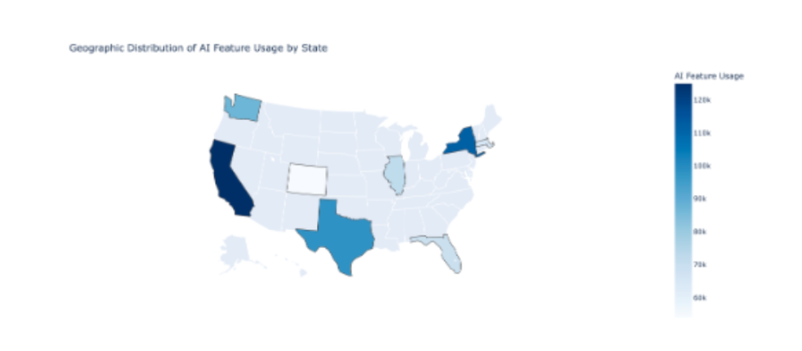
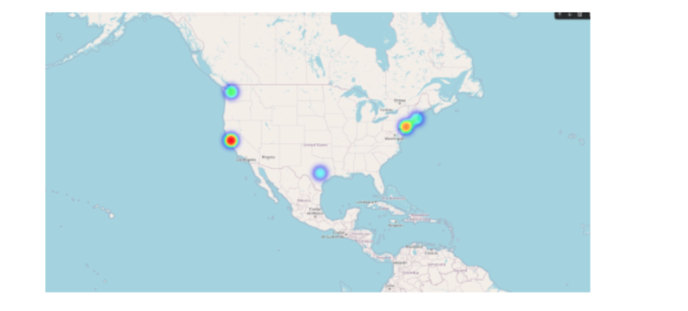

# 📅 Week 3 – Geospatial Analysis & Visualizations

## Focus: Geographic Patterns of AI Feature Usage

In Week 3, I extended my analysis to the **geospatial dimension** of AI feature demand. While temporal analysis revealed how usage evolved over time, geospatial analysis helped answer where AI demand is concentrated and how usage varies across regions.

Understanding geographic distribution is critical for infrastructure allocation, regional pricing strategy, and market expansion planning.

---

# 📍 Visualization 1: Geographic Distribution of AI Feature Usage (Choropleth Map)

### Purpose

To compare AI feature usage across states and identify regional differences in demand.

### Design Details

- **Geographic Unit:** U.S. states  
- **Encoding:** Color intensity (darker = higher usage)  
- **Metric:** Aggregated AI feature usage  

### Design Rationale

I selected a choropleth map to enable clear comparison across administrative regions. This design makes it easy to identify high-usage versus low-usage states while preserving recognizable geographic boundaries.

### Key Insights

- Certain states show significantly higher usage intensity.
- Usage distribution is uneven across regions.
- Regional concentration suggests localized demand patterns.

### Stakeholder Benefit

- **Leadership** can evaluate regional revenue concentration risk.
- **Engineering** can anticipate infrastructure scaling needs.
- **Product Teams** can assess geographic adoption differences.

---

# 🔥 Visualization 2: Geographic Clusters of AI Feature Demand (Heat Map)

### Purpose

To highlight clusters of concentrated AI usage independent of state boundaries.

Unlike the choropleth map, which respects administrative borders, the heat map emphasizes **usage density hotspots** based on spatial proximity.

### Design Details

- **Encoding:** Color gradient (warmer colors = higher usage density)
- **Visualization Type:** Density-based heat map
- **Geographic Scope:** North America (zoomed regional focus)

### Design Rationale

The heat map reveals spatial demand clusters that may not align neatly with state boundaries. This allows identification of metropolitan or high-density demand zones that could be obscured in state-level summaries.

Using both choropleth and heat map views provides complementary insight:

- Choropleth → Distribution across administrative regions  
- Heat Map → Concentration independent of boundaries  

### Key Insights

- High-demand clusters are concentrated in specific metropolitan regions.
- Some states show moderate overall usage but contain strong localized hotspots.
- Demand patterns do not always follow political boundaries.

### Stakeholder Benefit

- **Infrastructure Teams** can prioritize data center placement or scaling.
- **Strategy Teams** can identify high-growth markets.
- **Finance** can evaluate regional cost-to-value concentration.

---

# 🤖 Part 2: AI-Assisted Design Process

## Use of AI Tools

In Week 3, I used ChatGPT (GPT-5.2) to brainstorm geospatial visualization approaches and refine design decisions. AI supported exploration of map types and spatial encoding strategies but did not replace analytical judgment.

---

## Documentation of AI Interactions

### Example Prompts Used (Verbatim)

> “What geospatial visualization types are best for showing regional usage patterns in a SaaS platform?”

> “How can choropleth maps and heat maps be combined to highlight geographic demand clusters?”

These prompts focused on spatial design selection and stakeholder interpretation rather than implementation details.

---

## Implementation Plan

### Data Preparation

- Aggregated AI feature usage by state  
- Validated geographic identifiers  
- Standardized region names to avoid mapping errors  

### Tools Used

- **Power BI** → Interactive geospatial visualization  
- Built-in map layers for choropleth and density visualization  

Power BI was selected for:

- Interactive filtering  
- Hover tooltips  
- Accessibility for non-technical stakeholders  

---

## Handling Data Limitations

- Data was aggregated at state level.
- No fine-grained city-level data was available.
- Density visualization used approximated location markers.
- Limitations were documented to avoid over-interpretation.

---

## Evaluation of AI Suggestions

AI was helpful in identifying complementary map types and reinforcing geospatial design best practices. However, some suggestions assumed more granular location data than was available. These were simplified to match dataset constraints.

I manually applied best practices such as:

- Avoiding misleading color gradients  
- Ensuring clear legends  
- Matching granularity to data resolution  

AI served as a brainstorming assistant, while final design decisions were based on data availability and stakeholder needs.

---

## Week 3 Reflection

Week 3 expanded the project from temporal trend analysis to spatial intelligence. By combining choropleth and heat map visualizations, I developed a multi-layered understanding of geographic AI demand patterns.

This strengthened the project’s ability to inform infrastructure scaling, regional strategy, and cost-value optimization across markets.
