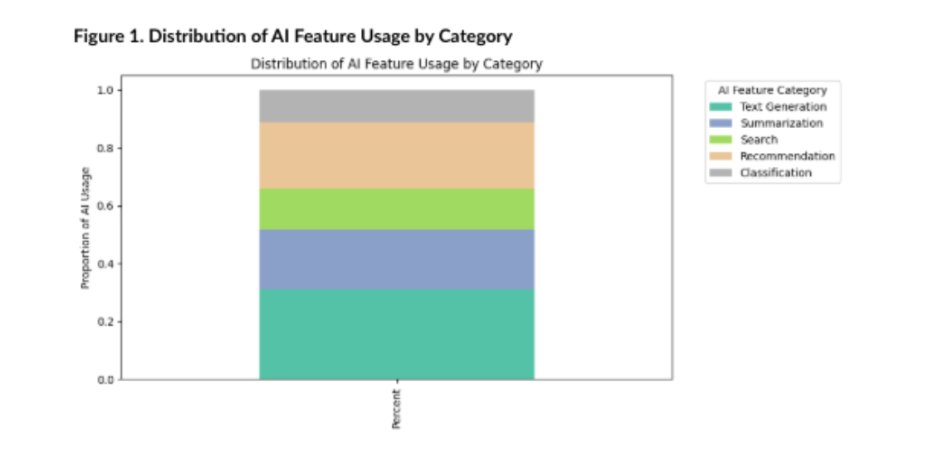
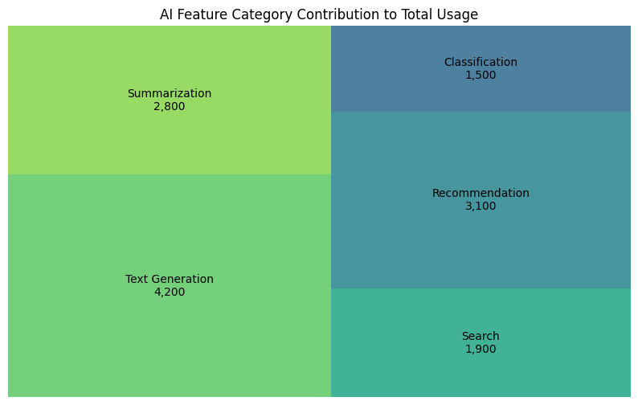

# 📅 Week 4 – Topical / Categorical Visualizations

## Focus: Categorical Patterns in AI Feature Usage

In Week 4, I shifted the analysis from temporal and spatial dimensions to **topical (categorical) patterns** in AI feature usage. While time-series and geographic views show when and where demand occurs, categorical analysis answers *what types of AI capabilities dominate system usage*.

Understanding feature categories is critical for product prioritization, infrastructure planning, and monetization strategy.

---

## Project Topic

**Categorical Patterns in AI Feature Usage for a SaaS Platform**

Rather than analyzing raw usage logs alone, I grouped AI features into capability categories:

- Text Generation  
- Summarization  
- Search  
- Recommendation  
- Classification  

This allowed stakeholders to interpret usage trends in a structured and meaningful way.

---

# 📊 Visualization 1: Distribution of AI Feature Usage by Category  
*(Stacked Bar Chart)*

### Purpose

To show how total AI usage is distributed across different feature categories.

### Design Details

- **X-axis:** Aggregate usage view  
- **Y-axis:** Proportion of total AI usage  
- **Encoding:** Stacked segments representing feature categories  

Values were normalized to percentages to improve interpretability for non-technical stakeholders.

### Design Rationale

I selected a stacked bar chart to clearly communicate proportional contribution of each category. This format enables quick comparison of relative dominance while maintaining a single consolidated view.

### Key Insights

- Text Generation accounts for the largest proportion of total usage.
- Recommendation and Summarization contribute significant secondary demand.
- Classification represents a smaller but consistent portion of usage.
- Usage distribution shows moderate concentration rather than complete dominance by one category.

### Stakeholder Benefit

- **Product Managers** can identify high-engagement capability areas.
- **Finance Teams** can evaluate which categories drive system load.
- **Leadership** can assess balance versus concentration in AI usage.

---

# 🌳 Visualization 2: AI Feature Category Contribution to Total Usage  
*(Treemap)*

### Purpose

To emphasize dominance and workload concentration among AI feature categories.

### Design Details

- **Encoding:** Rectangle size represents usage volume  
- **Labels:** Category name and usage count  
- **Color Variation:** Used to differentiate categories visually  

### Design Rationale

Treemaps are effective for executive-level summaries because they immediately highlight proportional dominance. The visual emphasis on area makes it easier to identify which categories consume the largest share of system resources.

### Key Insights

- Text Generation occupies the largest visual area, reinforcing its workload dominance.
- Recommendation and Summarization also contribute significantly to total demand.
- Smaller categories remain visible but clearly less dominant.

### Stakeholder Benefit

- **Engineering Teams** can identify workload concentration.
- **Finance** can estimate cost-heavy categories.
- **Leadership** can prioritize investment in dominant capabilities.

---

# Design Considerations and Limitations

Categorical visualizations simplify complex usage logs into interpretable themes. However:

- Aggregation can mask feature-level nuance.
- Category definitions influence interpretation.
- Smaller categories may appear less important despite strategic value.

To mitigate these risks:

- Categories were clearly defined.
- Values were normalized where appropriate.
- Interpretations avoided causal claims.

---

# 🤖 Part 2: AI-Assisted Design Process

## AI Tools Used

- ChatGPT (GPT-5.2 Thinking)

---

## Documented AI Interactions

### Prompt 1 (Verbatim)

> “What categorical patterns would be most useful for stakeholders analyzing AI feature usage in a SaaS platform?”

### Prompt 2 (Verbatim)

> “Suggest visualization types suitable for comparing categorical AI usage distributions.”

### Reasoning

These prompts were structured to guide early design exploration and ensure visualization choices aligned with categorical interpretation rather than temporal or predictive analysis.

---

## Evaluation of AI Suggestions

AI suggestions were helpful in identifying suitable categorical visualizations and framing stakeholder-focused questions. Some recommendations involving advanced NLP techniques were excluded because the dataset is structured rather than text-based.

Final design decisions emphasized:

- Clarity  
- Interpretability  
- Alignment with stakeholder needs  
- Adherence to assignment scope  

---

# Implementation Plan

## Data Preparation

- Mapped AI features to categorical labels using a predefined taxonomy  
- Aggregated usage counts by category  
- Normalized values to proportions for comparison  

## Tools and Libraries

- **Python (Pandas, NumPy)** → Data preparation  
- **Matplotlib** → Stacked bar chart  
- **Squarify** → Treemap visualization  

These tools were selected for simplicity, reproducibility, and alignment with course expectations.

---

## Week 4 Reflection

Week 4 demonstrated how categorical visualization techniques can clarify AI usage patterns beyond raw volume metrics. By translating numeric logs into meaningful feature categories, I created interpretable visual summaries that support clearer communication and better prioritization across product, engineering, and business teams.

This categorical layer complements the temporal and geospatial analyses developed in previous weeks.
